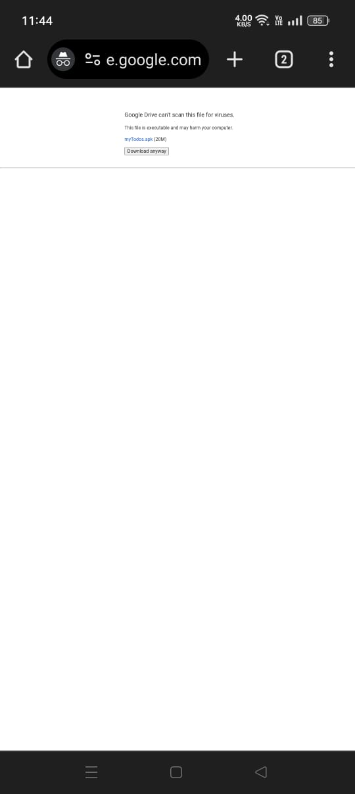

<h1 align="center">myTodos - App to make todos</h1>
 
Technology Used : <b>React-Native</b>
 
<h2>Requirements</h2>
<ul>
    <li>Android Mobile</li>
    <li>Internet Connection to Download the Application</li>
    <li>Storage : Approx. 50 Mb</li>
</ul>
 
<h2>Download & Installation Process : </h2>
<ul>
    <li>Click on <a href="https://drive.google.com/file/d/19e6-i8YAZNPV-7jPXLc2SaQqHphDliwD/view?usp=sharing">Download Application</a> </li>
    <li>Now , Click on Download
        
    </li>
    <li>Next you will see this screen Click on Download anyway, and after that you will see a download pop-up , click on Download and then Download will be started.
        
        
    </li>
    <li>
    <h3>Now comes the installation part...</h3>
    </li>
    <li>
        Click on the file you have downloaded and install it,If it show app maybe harmful its just because app is not hosted on playstore,so click on install anyway.
    </li>
    <li>So , Now the app has been installed on your device.</li>
</ul> 
 

